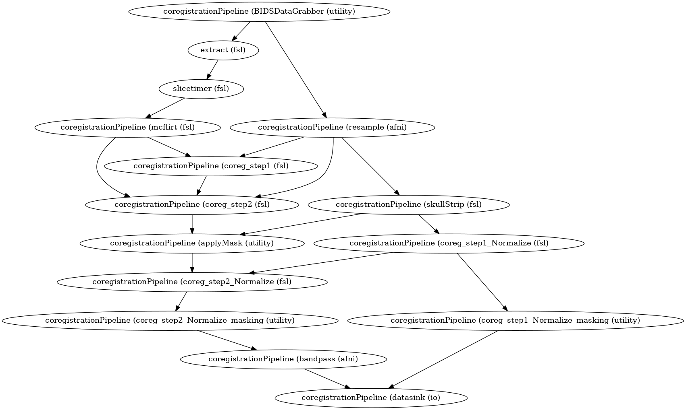

# Autism Connectome analysis

This Project does a group level analysis of fMRI scans of people with ASD. Following is a brief description of what each jupyter notebook does.

1) __Preprocessing__: This step does the basic preprocessing of the raw fMRI scans and registers to MNI125 2mm space.

Check out this notebook - *preprocessing_pipeline.ipnb*.    
Following is the baloon graph showing the preprocessing steps:  

**Preprocessing Workflow**  

2)  __Functional Connectiity__: After preprocessing, I extracted the timeseries of each of the ROI's given by the atlas that was constructed by merging two atlases:  
  * Brainnetome Cortical and Subcortical atlas
  * Cerebellum atlas

Then compute mean time series of each ROI. Correlate this mean timeseries with all the voxels to get a Functional Connectivity map of size [number-of-ROIs x number-of-voxels].     
Check out the notebook *functional_connectivity.ipynb*

3) __Hypothesis Testing__: I did a group level analysis. The two groups are Autism vs Typiclly developing. This resulted in saying which of the correlations were signifnificantly higher in one of the groups as compared to the other.

Check out the notebook - *hypothesis_test.ipynb*   

4) __FDR Correction__: The above step results in many Type I errors. FDR correction helps in reducing it.

Check out the notebook - *fdr_correction.ipynb*

TODO:

Add:
* Version
* Issue
* Hook to zenodo https://zenodo.org/ to get a DOI (Didital Object Identifier) So that people can cite this work.
